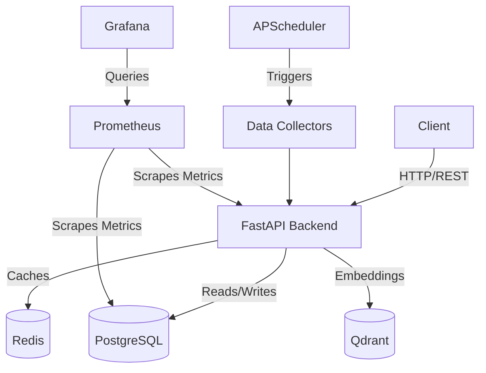

# Ceylon Sentinel AI

**An Autonomous Multi-Agent National Intelligence Platform for Disaster Prediction, Public Safety, Infrastructure Monitoring, and Decision Support in Sri Lanka.**

## Project Overview

Ceylon Sentinel AI is an enterprise-grade AI platform designed to provide real-time national intelligence and disaster prediction. Leveraging advanced machine learning, agentic AI, and large language models (LLMs), the platform empowers decision-makers in public safety and infrastructure monitoring.

## Architecture

The platform follows a modular, microservices-based architecture featuring:
- **Backend**: FastAPI
- **Frontend**: Next.js with React
- **Agentic AI**: Multi-agent orchestration layer
- **Databases**: PostgreSQL (Relational), Redis (Caching/Tasks), Qdrant (Vector DB)
- **Deployment**: Docker & Kubernetes ready

## Tech Stack
- Python 3.12, FastAPI, Pydantic, SQLAlchemy
- TypeScript, Next.js, TailwindCSS
- Docker, Docker Compose, GitHub Actions
- LangChain / LangGraph (Planned)

## Core Features

- **Day 01**: Microservices foundation, FastAPI backend, Next.js frontend, PostgreSQL, Docker Compose.
- **Day 02**: Data Collectors (Weather, News, Finance), Vector Embeddings, Qdrant Vector Store, Semantic Search.
- **Day 03**: Multi-Agent Architecture, LangGraph State Graphs, Tool Framework, `Coordinator -> Weather -> News -> Policy` execution.
- **Day 04**: AI Decision Engine, Dashboard Integration, Chat API (SSE Streaming), Live Workflow State.

## Folder Structure
- `backend/`: FastAPI application and API routes.
- `frontend/`: Next.js frontend application.
- `agents/`: AI agents for weather, news, policy, and coordination.
- `services/`: Core microservices including RAG, embeddings, and monitoring.
- `deployment/`: Docker, Kubernetes, and Terraform configurations.

## Future Roadmap
See [ROADMAP.md](ROADMAP.md) for detailed planning.

## Installation & Development

### Docker (Recommended)
1. Copy `.env.example` to `.env` and fill in the required variables.
2. Run the platform using Docker Compose:
   ```bash
   make up
   ```

### Local Development
See the [CONTRIBUTING.md](CONTRIBUTING.md) guide for local setup instructions.

## Project Architecture



## Documentation
Please refer to our detailed documentation in the `docs/` folder:
- [Developer Guide](docs/Developer_Guide.md)
- [Deployment Guide](docs/Deployment_Guide.md)
- [Docker Guide](docs/Docker_Guide.md)
- [API Guide](docs/API_Guide.md)
- [Collectors Guide](docs/Collectors_Guide.md)
- [Monitoring Guide](docs/Monitoring_Guide.md)
- [Architecture Decisions](docs/Architecture_Decisions.md)
- [Coding Standards](docs/Coding_Standards.md)

## License
This project is licensed under the MIT License - see the [LICENSE](LICENSE) file for details.
